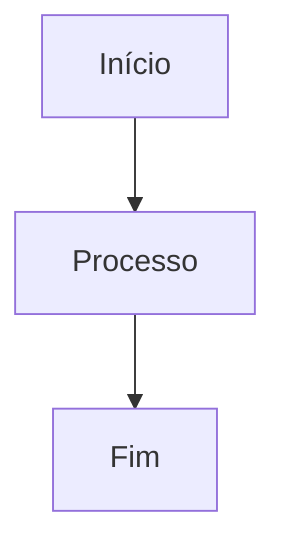

# 📋 Documentação de Features - Guia de Padronização

Este diretório contém toda a documentação detalhada das funcionalidades implementadas no projeto Endura, seguindo padrões específicos para manter consistência e facilitar a manutenção.

## 🎯 Objetivo

Garantir que qualquer desenvolvedor possa:
- Entender rapidamente uma funcionalidade existente
- Implementar novas features seguindo o padrão estabelecido
- Atualizar documentações de forma consistente
- Manter histórico completo das regras de negócio

## 📁 Estrutura Organizacional

```
docs/feature/
├── README.md                    # Este arquivo (guia de padronização)
├── auth/                        # Funcionalidades de autenticação
│   ├── README.md               # Visão geral do módulo
│   ├── login.md                # Documentação específica do login
│   ├── register.md             # Documentação do registro
│   └── jwt-flow.md             # Fluxo de tokens JWT
├── dashboard/                   # Funcionalidades do dashboard
│   ├── README.md               # Visão geral do dashboard
│   ├── home-screen.md          # Tela inicial
│   └── analytics.md            # Análises e métricas
├── workouts/                    # Funcionalidades de treinos
│   ├── README.md               # Visão geral dos treinos
│   ├── workout-list.md         # Listagem de treinos
│   ├── workout-detail.md       # Detalhes do treino
│   └── strava-sync.md          # Sincronização Strava
├── supplements/                 # Funcionalidades de suplementação
│   ├── README.md               # Visão geral da suplementação
│   ├── supplement-entry.md     # Entrada de suplementos
│   └── supplement-tracking.md  # Acompanhamento
└── integrations/               # Integrações externas
    ├── README.md               # Visão geral das integrações
    ├── strava-integration.md   # Integração Strava
    └── future-integrations.md  # Futuras integrações
```

## 📝 Padrão de Documentação

### 1. Estrutura Obrigatória por Feature

Cada arquivo de documentação **DEVE** conter as seguintes seções:

```markdown
# [Nome da Feature]

## 📖 Visão Geral
- Descrição sucinta da funcionalidade
- Objetivo principal
- Contexto de uso

## 👥 Stakeholders
- **Usuário Final**: Quem utiliza a feature
- **Desenvolvedor**: Responsável pela implementação
- **Product Owner**: Dono das regras de negócio

## 🎯 Regras de Negócio

### RN001 - [Nome da Regra]
- **Descrição**: Explicação detalhada da regra
- **Critério**: Condições que devem ser atendidas
- **Exceções**: Casos especiais ou exceções
- **Validações**: Validações necessárias

### RN002 - [Próxima Regra]
...

## 🖥️ Regras de Tela

### Interface Principal
- **Layout**: Descrição do layout da tela
- **Componentes**: Lista de componentes utilizados
- **Estados**: Estados possíveis da interface
- **Interações**: Como o usuário interage

### Validações de Frontend
- **Campos Obrigatórios**: Lista dos campos requeridos
- **Máscaras**: Formatação de campos
- **Mensagens**: Mensagens de erro e sucesso

## 🔗 Integrações

### APIs Internas
- Endpoints utilizados
- Métodos HTTP
- Payloads de request/response

### APIs Externas
- Serviços de terceiros
- Chaves de autenticação necessárias
- Rate limits e limitações

## 🧪 Cenários de Teste

### Casos de Sucesso
- Fluxo principal
- Cenários alternativos válidos

### Casos de Erro
- Validações que devem falhar
- Comportamentos esperados em falhas

## 📱 Responsividade
- Comportamento em diferentes resoluções
- Adaptações mobile
- Pontos de quebra importantes

## 🔐 Segurança
- Permissões necessárias
- Validações de segurança
- Dados sensíveis envolvidos

## 📋 Dependências
- **Frontend**: Bibliotecas e componentes
- **Backend**: Serviços e repositories
- **Database**: Tabelas e relacionamentos

## 🔄 Fluxo de Dados


## 📚 Referências
- Links para documentação externa
- RFCs relevantes
- Padrões seguidos
```

### 2. Nomenclatura de Arquivos

- Use **kebab-case** para nomes de arquivos: `workout-detail.md`
- Seja **descritivo** e **específico**: `strava-oauth-flow.md`
- Use **prefixos** quando necessário: `api-workout-endpoints.md`

### 3. Versionamento de Documentação

- **Data de criação** no cabeçalho
- **Histórico de alterações** no final do documento
- **Versão da feature** relacionada

```markdown
---
created: 2025-09-29
updated: 2025-09-29
version: 1.0.0
author: Nome do Desenvolvedor
---
```

## 🛠️ Como Documentar uma Nova Feature

### Passo 1: Criar Estrutura
```bash
# Criar diretório da feature
mkdir docs/feature/nova-feature

# Criar README.md da feature
touch docs/feature/nova-feature/README.md
```

### Passo 2: Documentar Regras de Negócio
- Listar **TODAS** as regras de negócio
- Numerar sequencialmente (RN001, RN002...)
- Detalhar critérios e exceções
- Incluir exemplos práticos

### Passo 3: Documentar Interface
- Descrever layout e componentes
- Listar validações de frontend
- Documentar estados da interface
- Incluir mockups ou wireframes

### Passo 4: Documentar Integrações
- APIs consumidas
- Estrutura de dados
- Fluxos de autenticação
- Tratamento de erros

### Passo 5: Cenários de Teste
- Casos de sucesso
- Casos de erro
- Edge cases
- Testes de integração

## 🔄 Atualizando Documentação Existente

### Quando Atualizar
- ✅ Nova funcionalidade adicionada
- ✅ Regra de negócio alterada
- ✅ Interface modificada
- ✅ Integração alterada
- ✅ Bug fix que afeta comportamento

### Como Atualizar
1. **Identifique** a documentação afetada
2. **Atualize** as seções relevantes
3. **Mantenha** histórico de alterações
4. **Valide** com stakeholders
5. **Faça commit** das alterações

### Template de Histórico
```markdown
## 📋 Histórico de Alterações

| Data       | Versão | Autor           | Alteração                    |
|------------|--------|-----------------|------------------------------|
| 2025-09-29 | 1.1.0  | João Silva      | Adicionada validação CPF     |
| 2025-09-28 | 1.0.0  | Maria Santos    | Criação inicial da feature   |
```

## ✅ Checklist de Qualidade

Antes de finalizar a documentação, verifique:

- [ ] Todas as seções obrigatórias estão preenchidas
- [ ] Regras de negócio estão numeradas e detalhadas
- [ ] Interface está documentada com componentes e validações
- [ ] Integrações estão listadas com exemplos
- [ ] Cenários de teste cobrem casos principais
- [ ] Documentação está atualizada com a implementação
- [ ] Linguagem está clara e objetiva
- [ ] Exemplos são práticos e relevantes
- [ ] Links e referências estão funcionais
- [ ] Histórico de alterações está atualizado

## 🎨 Ferramentas Recomendadas

### Diagramas
- **Mermaid**: Para fluxogramas e diagramas
- **Draw.io**: Para wireframes e mockups
- **Figma**: Para protótipos de alta fidelidade

### Validação
- **Markdownlint**: Para validar sintaxe Markdown
- **Vale**: Para revisar linguagem e estilo
- **GitHub Actions**: Para automação de validações

## 🤝 Boas Práticas

### ✅ Faça
- Use linguagem clara e objetiva
- Inclua exemplos práticos
- Mantenha documentação atualizada
- Revise com stakeholders
- Use diagramas quando necessário

### ❌ Evite
- Documentação muito técnica para usuários finais
- Informações desatualizadas
- Regras de negócio vagas
- Documentação muito extensa sem estrutura
- Links quebrados ou referências incorretas

---

## 📞 Suporte

Para dúvidas sobre documentação:
- 📧 **Email**: docs@endura.app
- 💬 **Slack**: #documentation
- 📋 **Issues**: GitHub Issues com label `documentation`

---

**Lembre-se**: Boa documentação é um investimento no futuro do projeto! 🚀