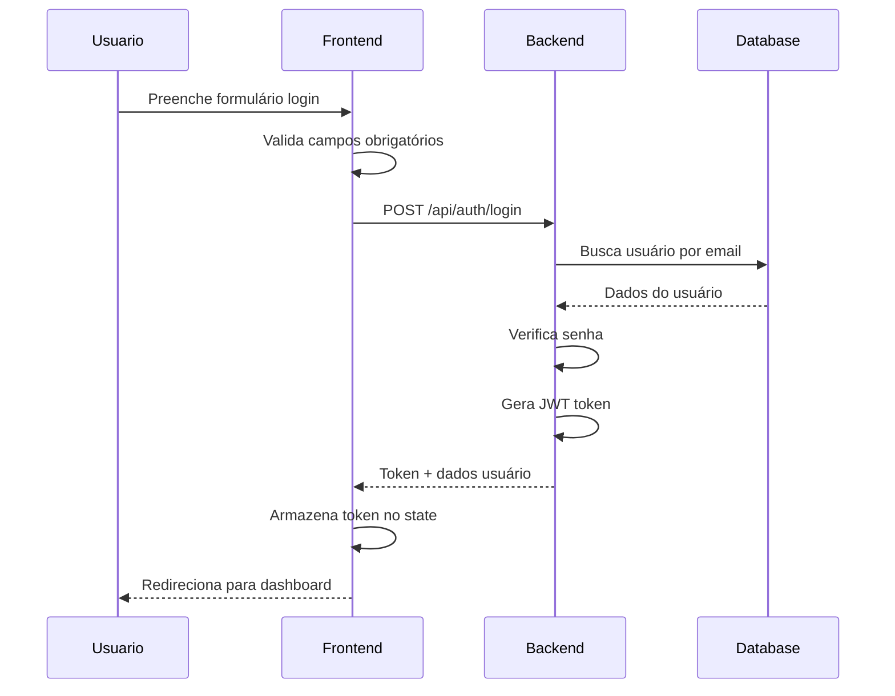

# 🔐 Módulo de Autenticação

---
created: 2025-09-29
updated: 2025-09-29
version: 1.0.0
author: Sistema Endura
---

## 📖 Visão Geral

O módulo de autenticação é responsável por gerenciar o acesso dos usuários à plataforma Endura, incluindo registro, login, logout e renovação de tokens JWT.

**Objetivo principal**: Garantir acesso seguro e controlado às funcionalidades da aplicação.

**Contexto de uso**: Primeira interação do usuário com a plataforma e manutenção de sessão ativa.

## 👥 Stakeholders

- **Usuário Final**: Atletas e treinadores que precisam acessar a plataforma
- **Desenvolvedor**: Equipe de desenvolvimento responsável pela implementação
- **Product Owner**: Define regras de segurança e fluxos de autenticação
- **Security Team**: Valida implementações de segurança

## 🎯 Regras de Negócio

### RN001 - Registro de Usuário
- **Descrição**: Usuário deve fornecer dados mínimos para criar conta
- **Critério**: Email único, senha forte, nome completo
- **Exceções**: Email já cadastrado retorna erro específico
- **Validações**: 
  - Email válido (regex)
  - Senha mínimo 8 caracteres
  - Nome não pode estar vazio

### RN002 - Login de Usuário
- **Descrição**: Autenticação via email e senha
- **Critério**: Credenciais devem existir no banco de dados
- **Exceções**: Conta inativa não pode fazer login
- **Validações**: 
  - Máximo 5 tentativas por hora
  - Bloqueio temporário após tentativas excessivas

### RN003 - Token JWT
- **Descrição**: Token de acesso com validade de 24 horas
- **Critério**: Token deve conter user_id, email e roles
- **Exceções**: Token expirado requer renovação
- **Validações**: 
  - Assinatura digital válida
  - Data de expiração não ultrapassada

### RN004 - Logout
- **Descrição**: Invalidação do token ativo
- **Critério**: Token deve ser removido do cliente
- **Exceções**: Logout sempre sucede, mesmo com token inválido
- **Validações**: Limpeza completa do estado de autenticação

## 🖥️ Regras de Tela

### Tela de Login
- **Layout**: Centralizado com logo, campos de email/senha, botões
- **Componentes**: 
  - Input de email (obrigatório)
  - Input de senha (obrigatório, tipo password)
  - Botão "Entrar" (primário)
  - Link "Criar conta" (secundário)
  - Link "Esqueci minha senha" (terciário)
- **Estados**: Loading durante autenticação, erro em caso de falha
- **Interações**: Submit no Enter, validação em tempo real

### Tela de Registro
- **Layout**: Similar ao login com campos adicionais
- **Componentes**:
  - Input de nome completo (obrigatório)
  - Input de email (obrigatório)
  - Input de senha (obrigatório)
  - Input de confirmação de senha (obrigatório)
  - Checkbox de termos de uso (obrigatório)
  - Botão "Criar conta" (primário)
- **Estados**: Loading durante criação, sucesso com redirecionamento
- **Interações**: Validação de senha em tempo real

### Validações de Frontend
- **Campos Obrigatórios**: Todos os campos são obrigatórios
- **Máscaras**: Email com validação de formato
- **Mensagens**: 
  - "Email ou senha incorretos" (login)
  - "Senha deve ter pelo menos 8 caracteres" (registro)
  - "Senhas não coincidem" (confirmação)

## 🔗 Integrações

### APIs Internas
```
POST /api/auth/register
Body: { firstName, lastName, email, password }
Response: { user: User, token: string }

POST /api/auth/login  
Body: { email, password }
Response: { user: User, token: string }

POST /api/auth/refresh
Header: Authorization: Bearer <token>
Response: { token: string }

POST /api/auth/logout
Header: Authorization: Bearer <token>
Response: { message: string }
```

### APIs Externas
- Nenhuma integração externa no módulo base de autenticação

## 🧪 Cenários de Teste

### Casos de Sucesso
- **Login válido**: Email e senha corretos retornam token
- **Registro válido**: Dados corretos criam usuário e retornam token
- **Refresh token**: Token válido é renovado com sucesso
- **Logout**: Token é invalidado corretamente

### Casos de Erro
- **Login inválido**: Email ou senha incorretos retornam 401
- **Email duplicado**: Registro com email existente retorna 409
- **Token expirado**: Acesso protegido retorna 401
- **Dados inválidos**: Campos obrigatórios vazios retornam 400

## 📱 Responsividade
- **Desktop**: Layout centrado com largura máxima de 400px
- **Tablet**: Mantém layout desktop
- **Mobile**: 
  - Campos ocupam largura total
  - Botões com altura mínima de 44px
  - Logo redimensionado proporcionalmente

## 🔐 Segurança
- **Permissões**: Endpoints públicos para login/registro
- **Validações**: 
  - Senha hasheada com bcrypt
  - JWT assinado com chave secreta
  - Rate limiting por IP
- **Dados sensíveis**: Senhas nunca retornadas em responses

## 📋 Dependências

### Frontend
- `react-router-dom`: Navegação entre telas
- `react-hook-form`: Gerenciamento de formulários
- `zustand`: Estado global de autenticação
- `axios`: Requisições HTTP

### Backend
- `spring-security`: Framework de segurança
- `jjwt`: Geração e validação de tokens JWT
- `bcrypt`: Hash de senhas
- `spring-boot-starter-validation`: Validações

### Database
- Tabela `users`: Armazena dados de usuários
- Índice único em `email`
- Campo `is_active` para soft delete

## 🔄 Fluxo de Dados



## 📚 Referências
- [JWT RFC 7519](https://tools.ietf.org/html/rfc7519)
- [OWASP Authentication Cheat Sheet](https://cheatsheetseries.owasp.org/cheatsheets/Authentication_Cheat_Sheet.html)
- [Spring Security Documentation](https://spring.io/projects/spring-security)

## 📋 Histórico de Alterações

| Data       | Versão | Autor           | Alteração                    |
|------------|--------|-----------------|------------------------------|
| 2025-09-29 | 1.0.0  | Sistema Endura  | Criação inicial da documentação |