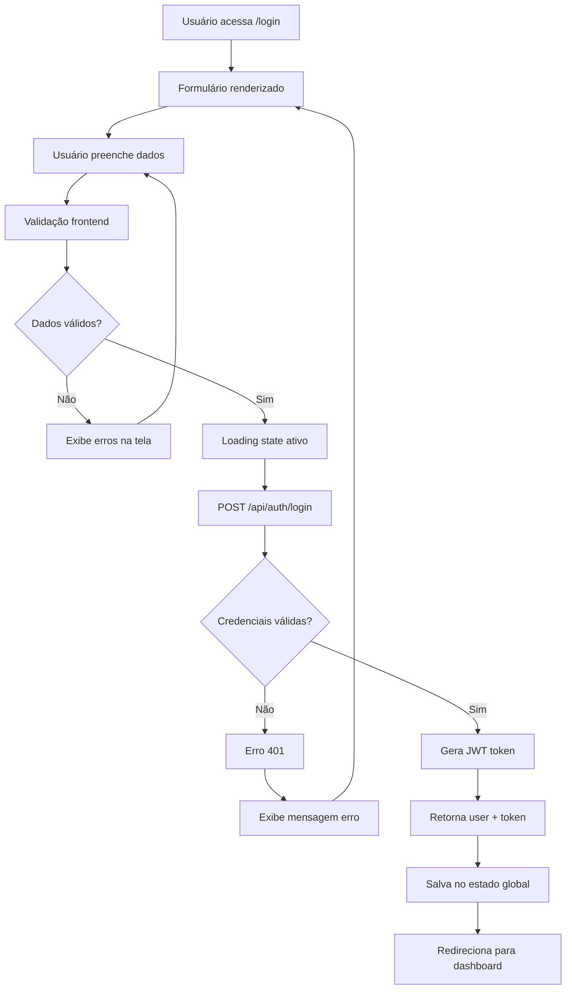

# 🔑 Login - Autenticação de Usuário

---
created: 2025-09-29
updated: 2025-09-29
version: 1.0.0
author: Sistema Endura
feature: Autenticação
---

## 📖 Visão Geral

Funcionalidade responsável pela autenticação de usuários já cadastrados na plataforma Endura, gerando token de acesso para navegação nas demais funcionalidades.

**Objetivo principal**: Permitir acesso seguro de usuários cadastrados à plataforma.

**Contexto de uso**: Primeiro acesso do usuário após abrir a aplicação ou quando o token expira.

## 👥 Stakeholders

- **Usuário Final**: Atletas e treinadores que já possuem conta
- **Desenvolvedor**: Implementação do fluxo de autenticação
- **Product Owner**: Define experiência de login

## 🎯 Regras de Negócio

### RN001 - Validação de Credenciais
- **Descrição**: Sistema deve validar email e senha fornecidos
- **Critério**: Email deve existir na base e senha deve coincidir com hash armazenado
- **Exceções**: Usuário inativo não pode fazer login
- **Validações**: 
  - Email formato válido
  - Senha não pode estar vazia
  - Usuário deve estar ativo (is_active = true)

### RN002 - Controle de Tentativas
- **Descrição**: Limitar tentativas de login por IP para evitar ataques
- **Critério**: Máximo 5 tentativas por hora por IP
- **Exceções**: Reset automático após 1 hora
- **Validações**: Contador por IP address com TTL

### RN003 - Geração de Token
- **Descrição**: Após autenticação bem-sucedida, gerar JWT token
- **Critério**: Token deve conter user_id, email, roles e expiração de 24h
- **Exceções**: Falha na geração retorna erro 500
- **Validações**: Token assinado com chave secreta da aplicação

### RN004 - Resposta de Autenticação
- **Descrição**: Retornar dados necessários para funcionamento da aplicação
- **Critério**: Token + dados básicos do usuário (sem dados sensíveis)
- **Exceções**: Senha nunca deve ser retornada
- **Validações**: Sanitização de dados de resposta

## 🖥️ Regras de Tela

### Interface Principal (LoginPage.tsx)
- **Layout**: 
  - Centralizado verticalmente e horizontalmente
  - Logo Endura no topo
  - Formulário com campos de email e senha
  - Botão primário "Entrar"
  - Links secundários "Criar conta" e "Esqueci minha senha"
  
- **Componentes**:
  - `Input` para email (tipo email, obrigatório)
  - `Input` para senha (tipo password, obrigatório)
  - `Button` primário para submit
  - `Link` para registro de nova conta
  - `Alert` para mensagens de erro

- **Estados**:
  - **Idle**: Estado inicial, formulário limpo
  - **Loading**: Durante requisição de login
  - **Error**: Exibe mensagem de erro
  - **Success**: Redireciona para dashboard

- **Interações**:
  - Submit do formulário ao pressionar Enter
  - Validação em tempo real dos campos
  - Feedback visual durante loading
  - Navegação para registro via link

### Validações de Frontend
- **Campos Obrigatórios**: Email e senha são obrigatórios
- **Máscaras**: Validação de formato de email
- **Mensagens**: 
  - "Email é obrigatório"
  - "Senha é obrigatória"
  - "Email deve ter formato válido"
  - "Email ou senha incorretos" (genérico para segurança)

## 🔗 Integrações

### API Backend
```typescript
// Endpoint de login
POST /api/auth/login
Content-Type: application/json

// Request
{
  "email": "usuario@exemplo.com",
  "password": "minhasenha123"
}

// Response Success (200)
{
  "user": {
    "id": 1,
    "firstName": "João",
    "lastName": "Silva", 
    "email": "usuario@exemplo.com",
    "isActive": true,
    "createdAt": "2025-09-29T10:00:00Z"
  },
  "token": "eyJhbGciOiJIUzI1NiIsInR5cCI6IkpXVCJ9..."
}

// Response Error (401)
{
  "error": "Invalid credentials",
  "message": "Email ou senha incorretos",
  "timestamp": "2025-09-29T10:00:00Z"
}
```

### Estado Global (Zustand)
```typescript
// authStore.ts
interface AuthState {
  user: User | null;
  token: string | null;
  isAuthenticated: boolean;
  isLoading: boolean;
  login: (email: string, password: string) => Promise<void>;
  logout: () => void;
}
```

## 🧪 Cenários de Teste

### Casos de Sucesso
1. **Login com credenciais válidas**
   - Input: email existente + senha correta
   - Expected: Token gerado + redirecionamento para dashboard

2. **Persistência de autenticação**
   - Input: Login bem-sucedido + refresh da página
   - Expected: Usuário continua logado

### Casos de Erro
1. **Email inexistente**
   - Input: email não cadastrado + qualquer senha
   - Expected: Erro 401 + mensagem genérica

2. **Senha incorreta**
   - Input: email válido + senha incorreta
   - Expected: Erro 401 + mensagem genérica

3. **Campos vazios**
   - Input: email ou senha vazios
   - Expected: Validação frontend + campos destacados

4. **Usuário inativo**
   - Input: credenciais de usuário desativado
   - Expected: Erro 401 + mensagem de conta inativa

5. **Rate limiting**
   - Input: 6+ tentativas na mesma hora
   - Expected: Erro 429 + mensagem de bloqueio temporário

## 📱 Responsividade

### Desktop (1024px+)
- Container com largura máxima de 400px
- Campos com altura padrão de 40px
- Espaçamentos generosos entre elementos

### Tablet (768px - 1023px)
- Mantém layout desktop
- Logo ligeiramente menor

### Mobile (320px - 767px)
- Container ocupa 90% da largura da tela
- Campos com altura mínima de 44px (touch-friendly)
- Logo redimensionado para 80% do tamanho desktop
- Margens reduzidas para otimizar espaço

## 🔐 Segurança

### Frontend
- **Validações**: Email format, campos obrigatórios
- **Armazenamento**: Token em memory store (não localStorage)
- **HTTPS**: Todas as requisições em produção

### Backend
- **Hash**: Senhas hasheadas com bcrypt (cost 12)
- **JWT**: Token assinado com HS256
- **Rate Limiting**: 5 tentativas por hora por IP
- **Logs**: Tentativas de login logadas para auditoria

## 📋 Dependências

### Frontend
```json
{
  "react-hook-form": "^7.45.0",
  "react-router-dom": "^6.15.0", 
  "zustand": "^4.4.0",
  "axios": "^1.5.0"
}
```

### Backend
```xml
<dependency>
    <groupId>org.springframework.boot</groupId>
    <artifactId>spring-boot-starter-security</artifactId>
</dependency>
<dependency>
    <groupId>io.jsonwebtoken</groupId>
    <artifactId>jjwt-api</artifactId>
</dependency>
```

### Database
- Tabela: `users`
- Campos utilizados: `id`, `email`, `password`, `is_active`
- Índices: `email` (UNIQUE)

## 🔄 Fluxo de Dados



## 📚 Referências
- [React Hook Form - Login Form](https://react-hook-form.com/get-started)
- [JWT Best Practices](https://auth0.com/blog/a-look-at-the-latest-draft-for-jwt-bcp/)
- [OWASP Session Management](https://cheatsheetseries.owasp.org/cheatsheets/Session_Management_Cheat_Sheet.html)

## 📋 Histórico de Alterações

| Data       | Versão | Autor           | Alteração                    |
|------------|--------|-----------------|------------------------------|
| 2025-09-29 | 1.0.0  | Sistema Endura  | Criação inicial da documentação |