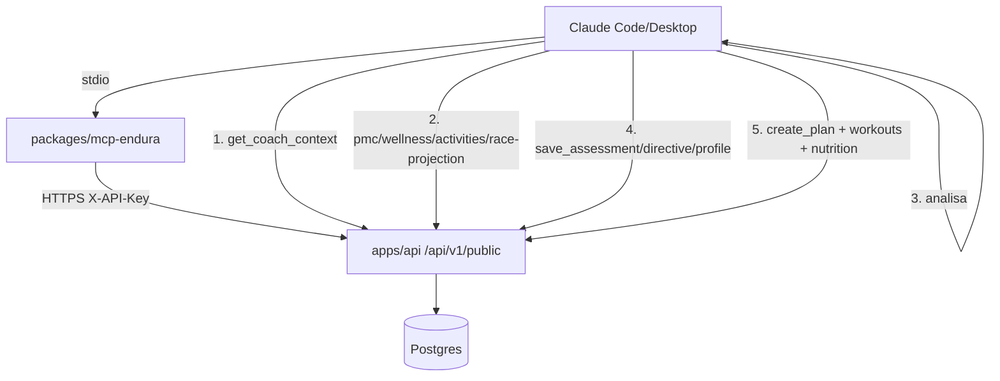

# Coach via MCP + Memória do Atleta

## 📖 Visão Geral

Transforma o Endura em **consultor/treinador completo** dirigido por um LLM (Claude) via **MCP** (Model Context Protocol), sem o Endura precisar de LLM próprio. O Claude conecta por MCP (stdio), lê a base persistida do atleta, analisa (PMC, wellness, previsão de prova), e **grava de volta no Endura** análises, diretrizes e planos de treino com suplementação embutida — de modo que **toda nova sessão recupera o contexto**.

Três entregas:
1. **Memória do coach** — modelo a nível de atleta (`coach_profile`, `coach_assessments`, `coach_directives`) que vira a "base" lida no início de cada sessão.
2. **API pública estendida** — leitura da memória + previsão de prova + escrita autoritativa de planos/treinos + suplementação por treino.
3. **Servidor MCP** (`@endura/mcp`, `packages/mcp-endura`) — wrapper stdio sobre a API pública (28 tools) para Claude Code/Desktop.
4. **Lacunas Garmin** — o sync do intervals.icu passa a capturar VO2max, frequência respiratória, readiness do intervals e a derivar HRV status.

## 👥 Stakeholders

- **Usuário Final**: triatleta que usa o Claude como treinador e quer continuidade entre sessões.
- **Desenvolvedor**: mantém API pública + pacote MCP (catálogo de tools espelha `openapi.spec.ts`).
- **Product Owner**: define a filosofia do "consultor completo" (previsão de prova + suplementação nos treinos).

## 🎯 Regras de Negócio

### RN001 - Âncora de contexto da sessão
- **Descrição**: Toda sessão de coaching começa por `GET /api/v1/public/coach/context` (tool `endura_get_coach_context`).
- **Critério**: Retorna `coach_profile`, diretrizes `active`, últimas 10 `coach_assessments` e snapshot (perfil, próximo treino, atividade de hoje, wellness, prova ativa).
- **Validações**: scope `read:coach`.

### RN002 - Memória persistente (a base "fica no Endura para sempre")
- **Descrição**: O Claude grava o que produz: análises (`coach_assessments`, append-only), diretrizes vigentes (`coach_directives`) e o perfil de coaching (`coach_profile`, 1:1 com o atleta).
- **Critério**: `coach_assessments` nunca é sobrescrito (histórico). Diretrizes têm `status` (`active`/`superseded`/`done`); ao criar com `supersedesId`, a anterior vira `superseded`.
- **Exceções**: `coach_profile` é upsert (1 linha por atleta).
- **Validações**: scope `write:coach`; `raceGoalId`/`supersedesId` validam ownership.

### RN003 - Escrita autoritativa de plano + suplementação por treino
- **Descrição**: O Claude grava planos direto: `training_plans` (container), `planned_workouts` (lote, max 80) e o protocolo nutricional do treino (`nutrition_protocols`, diferencial Endura).
- **Critério**: `startDate <= endDate`; `planId`/treino validam ownership; o protocolo substitui o existente do treino (upsert por `plannedWorkoutId`).
- **Validações**: scope `write:planned`.

### RN004 - Scopes
- **Descrição**: Novos scopes `read:coach`, `write:coach`, `write:planned`. Wildcards `read:all`/`write:all` os cobrem por prefixo (`satisfies()`). Bundle **Coach** = todos os reads + writes.

### RN005 - Lacunas Garmin via intervals.icu
- **Descrição**: `wellness-sync` passa a persistir `vo2max`, `respirationRate`, `intervalsReadiness` e a derivar `hrvStatus`.
- **Critério**: `hrvStatus` = `low`/`balanced`/`high` comparando o HRV do dia com baseline pessoal (média ± 0,75·desvio dos últimos 60 dias); `unknown` se < 14 amostras. `hrvBaseline` é mantido.
- **Exceções**: estágios de sono / recovery time / running dynamics dependem de integração Garmin direta (fase futura) — colunas existem mas só populam se o payload trouxer.

### RN006 - Auditoria e rate limit
- **Descrição**: Toda escrita via API Key é auditada (`api_audit_logs`, hook `onResponse`). Limites: 120 GET/min, 30 escrita/min por key.

## 🔗 Integrações

### APIs Internas (novos endpoints `/api/v1/public`)

| Método | Rota | Scope |
|---|---|---|
| GET | `/coach/context` | read:coach |
| GET·POST | `/coach/assessments` | read:coach · write:coach |
| GET·POST | `/coach/directives` | read:coach · write:coach |
| PATCH | `/coach/directives/:id` | write:coach |
| PUT | `/coach/profile` | write:coach |
| GET | `/race-projection` | read:profile |
| POST | `/training-plans` | write:planned |
| POST | `/planned-workouts/bulk` | write:planned |
| PUT·DELETE | `/planned-workouts/:id` | write:planned |
| POST | `/planned-workouts/:id/nutrition-protocol` | write:planned |

Reuso: `performance.service.ts` (`calculatePMC`, `getTargetRace`) para `/race-projection`.

### APIs Externas
- **intervals.icu** `GET /athlete/{id}/wellness` — campos adicionais `vo2max`, `respiration`, `readiness`.
- **MCP**: `@modelcontextprotocol/sdk` (stdio). Auth na API por `X-API-Key`.

## 🧪 Cenários de Teste

### Casos de Sucesso
- `tools/list` do MCP retorna 28 tools (`node dist/index.js` + handshake stdio).
- Key com bundle Coach: `GET /coach/context` 200; `POST /coach/assessments` 201; `POST /training-plans` + `POST /planned-workouts/bulk` 201; `POST /planned-workouts/:id/nutrition-protocol` 201; reconexão recupera a base.
- Sync popula `vo2max`/`respirationRate`/`hrvStatus`; visíveis em `GET /wellness`.

### Casos de Erro
- Key sem `write:planned` → 403 `ERR_INSUFFICIENT_SCOPE`.
- `planId`/treino de outro usuário → 404.
- `startDate > endDate` → 400 `ERR_INVALID_RANGE`.

## 🔐 Segurança
- API Key per-usuário (SHA-256), scopes granulares, ownership em todo write, audit log de escrita, rate limit dedicado. MCP nunca acessa o banco direto — só a REST autenticada.

## 📋 Dependências
- **Backend**: `public-api.routes.ts`, `openapi.spec.ts`, `llm-manual.routes.ts`, `api-key/scopes.ts`, `integration/wellness-sync.service.ts`, `performance/performance.service.ts`.
- **Database**: novas tabelas `coach_profile`, `coach_assessments`, `coach_directives`; colunas novas em `daily_metrics`. Migration `drizzle/migrations/0006_coach_memory_garmin_fields.sql`.
- **Pacote**: `packages/mcp-endura` (`@endura/mcp`).

## 🔄 Fluxo de Dados

## 📚 Referências
- Manual do agente: `GET /api/v1/public/llm-manual.md` (seção 5.6 — fluxo de coaching) e `docs/llm-manual.md`.
- Spec: `GET /api/v1/public/openapi.json` · Tools: `/openapi/tools.json` · MCP: `packages/mcp-endura/README.md`.

## 📋 Histórico de Alterações

| Data       | Versão | Autor  | Alteração                                   |
|------------|--------|--------|---------------------------------------------|
| 2026-06-25 | 1.0.0  | Daniel | Criação: coach via MCP, memória do atleta, escrita de plano, lacunas Garmin |
