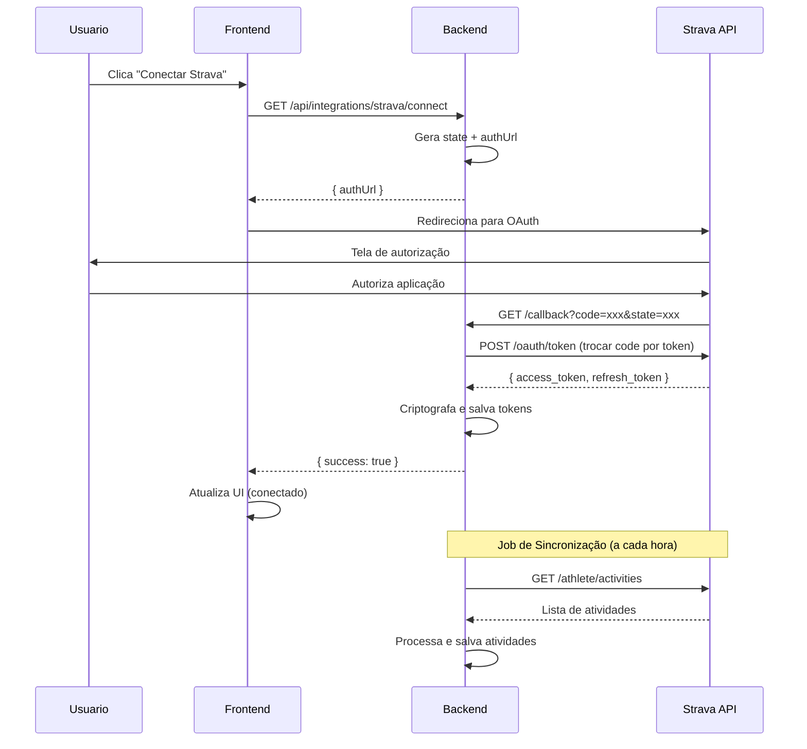

# 🔗 Integração com Strava

---
created: 2025-09-29
updated: 2025-09-29
version: 1.0.0
author: Sistema Endura
feature: Integrações Externas
---

## 📖 Visão Geral

Funcionalidade responsável pela integração com a API do Strava, permitindo sincronização automática de atividades físicas dos usuários que conectarem suas contas.

**Objetivo principal**: Importar automaticamente treinos e atividades do Strava para análise na plataforma Endura.

**Contexto de uso**: Usuário deseja conectar sua conta Strava para sincronizar atividades automaticamente.

## 👥 Stakeholders

- **Usuário Final**: Atletas que usam Strava para registrar atividades
- **Desenvolvedor**: Implementação da integração OAuth e sync de dados
- **Product Owner**: Define quais dados do Strava são relevantes
- **Strava**: Plataforma externa que fornece os dados

## 🎯 Regras de Negócio

### RN001 - Autenticação OAuth
- **Descrição**: Usuário deve autorizar acesso via OAuth 2.0 do Strava
- **Critério**: Fluxo OAuth padrão com redirect para callback
- **Exceções**: Usuário pode cancelar autorização
- **Validações**: 
  - Client ID e Secret válidos
  - Redirect URI autorizada no Strava
  - Estado (state) para prevenção de CSRF

### RN002 - Armazenamento de Tokens
- **Descrição**: Access e Refresh tokens devem ser armazenados com segurança
- **Critério**: Tokens criptografados na tabela integrations
- **Exceções**: Tokens expirados devem ser renovados automaticamente
- **Validações**:
  - Criptografia AES-256 para tokens
  - Refresh token usado para renovação
  - TTL baseado na resposta do Strava

### RN003 - Sincronização de Atividades
- **Descrição**: Importar atividades do Strava periodicamente
- **Critério**: Job executado a cada 1 hora para usuários conectados
- **Exceções**: Falha na API não deve quebrar outras integrações
- **Validações**:
  - Rate limit respeitado (100 requests/15min)
  - Deduplicação baseada em external_id
  - Apenas atividades públicas são importadas

### RN004 - Desconexão de Conta
- **Descrição**: Usuário pode desconectar integração a qualquer momento
- **Critério**: Remove tokens e para sincronização
- **Exceções**: Atividades já importadas são mantidas
- **Validações**: Revogação de token no Strava (opcional)

## 🖥️ Regras de Tela

### Botão de Conexão
- **Layout**: Botão laranja com logo do Strava
- **Componentes**: 
  - Ícone do Strava (SVG)
  - Texto "Conectar com Strava"
  - Estado loading durante OAuth
- **Estados**: 
  - **Desconectado**: Botão "Conectar com Strava"
  - **Conectando**: Loading spinner
  - **Conectado**: Status "✓ Conectado" + botão "Desconectar"
- **Interações**: Click abre popup OAuth do Strava

### Modal de Configuração
- **Layout**: Modal centralizado com configurações da integração
- **Componentes**:
  - Status da conexão
  - Data da última sincronização
  - Número de atividades importadas
  - Botão para sincronização manual
  - Botão para desconectar
- **Estados**: Loading durante operações
- **Interações**: Confirmação antes de desconectar

### Validações de Frontend
- **Popup Blocker**: Verificar se popup OAuth foi bloqueado
- **Timeout**: Timeout de 2 minutos para OAuth
- **Mensagens**:
  - "Conectando com Strava..."
  - "Conexão realizada com sucesso"
  - "Erro na conexão. Tente novamente"
  - "Sincronizando atividades..."

## 🔗 Integrações

### APIs Internas
```typescript
// Iniciar OAuth flow
GET /api/integrations/strava/connect
Response: { authUrl: string }

// Callback OAuth
GET /api/integrations/strava/callback?code=xxx&state=xxx
Response: { success: boolean, message: string }

// Status da integração
GET /api/integrations/strava/status
Response: {
  isConnected: boolean,
  lastSync?: string,
  activitiesCount?: number
}

// Desconectar
DELETE /api/integrations/strava/disconnect
Response: { success: boolean }

// Sincronização manual
POST /api/integrations/strava/sync
Response: { 
  syncedCount: number,
  errors: string[]
}
```

### API do Strava
```typescript
// OAuth Authorization
GET https://www.strava.com/oauth/authorize
Params: {
  client_id: string,
  response_type: 'code',
  redirect_uri: string,
  approval_prompt: 'force',
  scope: 'read,activity:read'
}

// Token Exchange
POST https://www.strava.com/oauth/token
Body: {
  client_id: string,
  client_secret: string,
  code: string,
  grant_type: 'authorization_code'
}

// Refresh Token
POST https://www.strava.com/oauth/token
Body: {
  client_id: string,
  client_secret: string,
  refresh_token: string,
  grant_type: 'refresh_token'
}

// Get Activities
GET https://www.strava.com/api/v3/athlete/activities
Headers: { Authorization: 'Bearer <token>' }
Params: { per_page: 30, page: 1 }
```

## 🧪 Cenários de Teste

### Casos de Sucesso
1. **Conexão OAuth completa**
   - Input: Usuário clica "Conectar", autoriza no Strava
   - Expected: Tokens salvos + status conectado

2. **Sincronização de atividades**
   - Input: Usuário conectado + job de sync executado
   - Expected: Atividades do Strava aparecem na lista

3. **Renovação automática de token**
   - Input: Token expirado + tentativa de sync
   - Expected: Token renovado automaticamente + sync continua

4. **Desconexão**
   - Input: Usuário clica "Desconectar"
   - Expected: Tokens removidos + status desconectado

### Casos de Erro
1. **Usuário cancela OAuth**
   - Input: Usuário clica "Deny" no Strava
   - Expected: Volta para tela anterior + mensagem informativa

2. **Token inválido/revogado**
   - Input: Token revogado no Strava + tentativa de sync
   - Expected: Integração desconectada + notificação para usuário

3. **Rate limit excedido**
   - Input: Muitas requisições para API Strava
   - Expected: Pausa na sincronização + retry após cooldown

4. **API Strava indisponível**
   - Input: API Strava retorna 5xx
   - Expected: Erro logado + retry com backoff exponencial

## 📱 Responsividade

### Desktop
- Modal de configuração com largura fixa de 500px
- Botão de conexão com largura de 280px

### Mobile
- Modal ocupa 95% da largura da tela
- Botão de conexão adapta à largura do container
- Texto pode quebrar em duas linhas se necessário

## 🔐 Segurança

### Proteção de Dados
- **Tokens**: Criptografados com AES-256 no banco
- **CSRF**: State parameter no OAuth flow
- **HTTPS**: Todas as comunicações criptografadas

### Permissões Strava
- **Escopo mínimo**: `read,activity:read`
- **Dados acessados**: Apenas atividades públicas
- **Não acessamos**: Dados privados, segmentos, kudos

### Rate Limiting
- **Strava**: 100 requests/15min + 1000 requests/day
- **Interno**: Throttling para respeitar limites
- **Monitoramento**: Logs de uso da API

## 📋 Dependências

### Frontend
```json
{
  "react": "^18.2.0",
  "axios": "^1.5.0"
}
```

### Backend
```xml
<dependency>
    <groupId>org.springframework.boot</groupId>
    <artifactId>spring-boot-starter-web</artifactId>
</dependency>
<dependency>
    <groupId>org.springframework.boot</groupId>
    <artifactId>spring-boot-starter-data-jpa</artifactId>
</dependency>
```

### Configurações
```yaml
strava:
  client-id: ${STRAVA_CLIENT_ID:your_client_id}
  client-secret: ${STRAVA_CLIENT_SECRET:your_client_secret}
  redirect-uri: ${STRAVA_REDIRECT_URI:http://localhost:3000/strava/callback}
```

### Database
- **Tabela**: `integrations`
- **Campos**: `user_id`, `platform`, `access_token`, `refresh_token`, `expires_at`
- **Relacionamentos**: FK para `users`

## 🔄 Fluxo de Dados



## 🔧 Configuração

### Criar App no Strava
1. Acesse [Strava Developers](https://developers.strava.com)
2. Crie nova aplicação
3. Configure Authorization Callback Domain
4. Obtenha Client ID e Client Secret

### Variáveis de Ambiente
```bash
STRAVA_CLIENT_ID=your_client_id_here
STRAVA_CLIENT_SECRET=your_client_secret_here
STRAVA_REDIRECT_URI=http://localhost:3000/strava/callback
```

## 📚 Referências
- [Strava API Documentation](https://developers.strava.com/docs/)
- [OAuth 2.0 RFC](https://tools.ietf.org/html/rfc6749)
- [Strava Rate Limiting](https://developers.strava.com/docs/rate-limits/)

## 📋 Histórico de Alterações

| Data       | Versão | Autor           | Alteração                    |
|------------|--------|-----------------|------------------------------|
| 2025-09-29 | 1.0.0  | Sistema Endura  | Criação inicial da documentação |